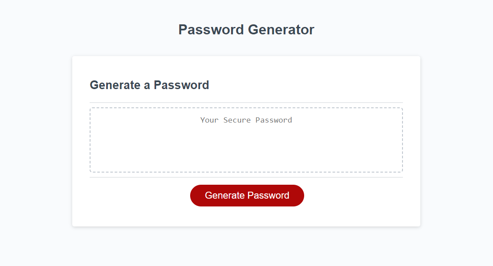
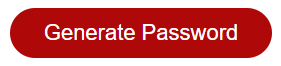
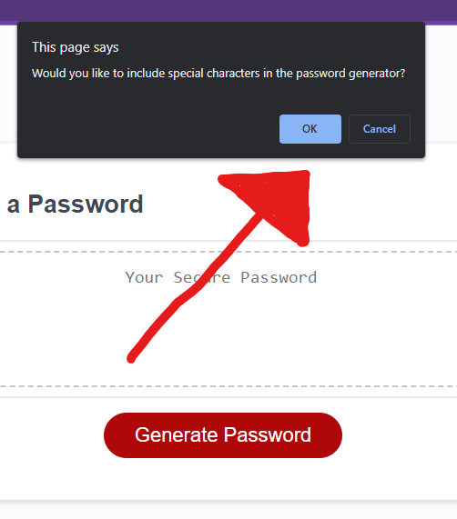
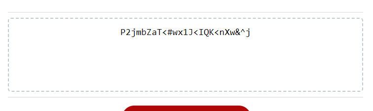
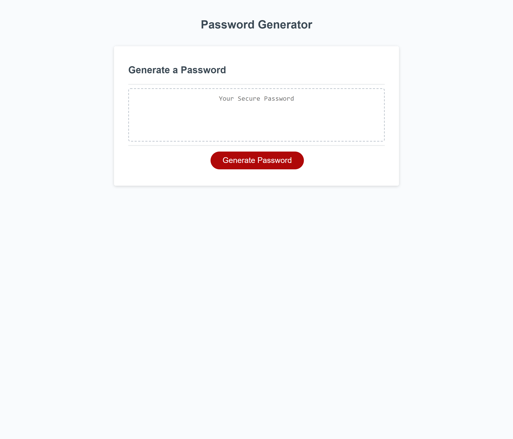

# Password Generator

## About
In today's day and age, just about every application we use either requires, or at least offers, us to register an account with a password. These accounts often contain sensitive information about ourselves, or our businesses, and should be protected behind a secure password. This application will generate a random password each time, using certain parameters that you choose. Although randomly generated passwords can be hard to remember, they are even harder to guess. So be sure to keep your password in some kind of password manager, or written down somewhere discreet. Upon choosing which characters you would like included, you will be able to set a length for the password, adding to the randomness of the generator.

## Table of Contents
- [Installation](#installation)
- [Usage](#usage)
- [Deployed-Application](#deployed-application)

## Installation
All that is required is a device with access to a web browser.

## Usage
Opening up the application will bring you to this page:

Click the button here to begin:
### 

Then some prompts will open up asking if you would like to include certain characters. Press <strong>ok</strong> to include, <strong>cancel</strong> to decline:

When it asks how long you would like the password to be, you must enter a numeric value and the number must be at least 8, but no greater than 128. This will dictate how many characters the randomly generated password will have.
- Entering something like: "twenty" is not going to work. You have to enter that as 20.

Upon entering a value, the application will then generate the random password, and place it on the page here:

From there, you can select the password and copy it.

## Deployed Application
**Live URL here: [_https://jebulger.github.io/password-generator/_](https://jebulger.github.io/password-generator/)**

